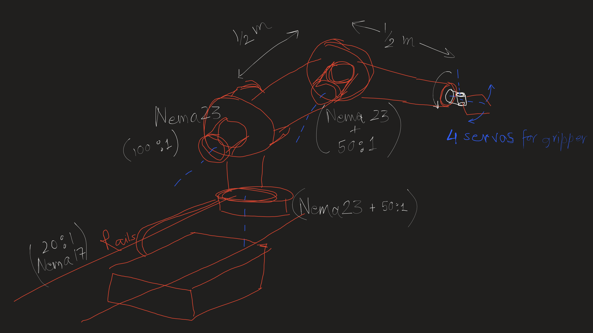
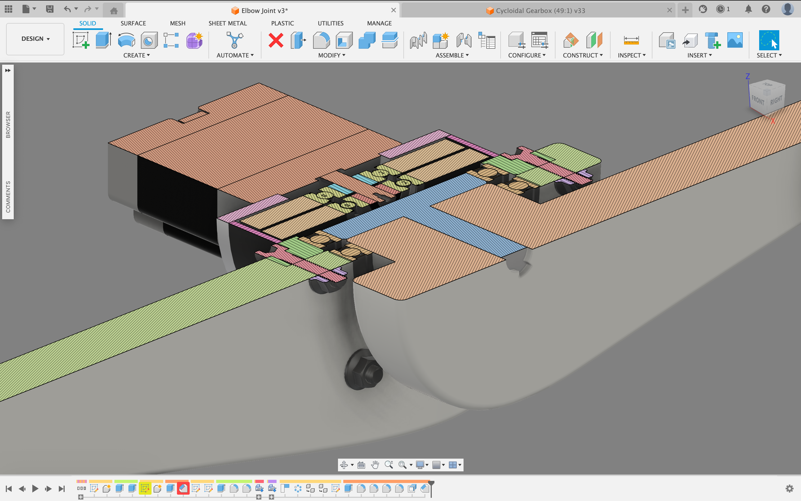

# Project Robotic Arm(name-undecided):
Rough initial design sketch. 

# 1. Physical Design

## a. Actuators:
- Nema23: `maximum torque output = 1.89 Nm`
- Nema17: `maximum torque output = 1.0 Nm`

**Things to keep in mind:** 
At an increase in load/torque, the angular speed drops surprisingly quickly! 
Consider a NEMA 23 stepper motor with a torque rating of 1.9 Nm at low speeds. A typical torque-speed curve might look like this:
  - 0 RPM: 1.9 Nm (maximum torque) 
  - 500 RPM: 1.5 Nm
  - 1000 RPM: 1.0 Nm
  - 1500 RPM: 0.5 Nm
  - 2000 RPM: 0.1 Nm
 

## b. Gear Reduction:
Render of the Cycloidal drive. A fusion360 plugin was developed to model the cycloid geometrically accurately.

)

  - **To set up** this particular "Add-In" in your fusion360 you can clone this repository in your systems by running the following in your terminal:
   `git clone <link to this repository>`. 
  - Then import this add in from with in your fusion360 Add-Ins option, available in the utilities tab.

    <u> OR:</u> 
 
  - You can simply create a new Add-Ins.
  - Select it and then click on "edit", it should open in VScode or your default IDE.
  - Then you can just copy and paste the code from `Cycloidal Gearbox/Cycloidal Gearbox.py`.

Fusion360 design for a (49:1) ratio cycloidal gear paired with Nema23: https://a360.co/4dJKYbK
(please contact the moderator for the password) 

## c. Elbow Joint Design:

Possible Improvements:
- For better handeling axial loads the arm should be screwed to secure with the shaft instead of this passive fixation on ball bearing, ball bearing should only be there for radial support.

## d. Torque-RPM Characterization Setup:
A load cell based setup would be needed to physically characterizethe performance of the actuator and gearbox combo, that'll be needed in order to tune parameters in the control algorithms.
We would need high resolution Torque-RPM data for tuning the control, to make it very accurate and precise.

## e. Base Design:
The arm will be mounted on a platform that could be slided across the x axis with a high precision, to increase the accessible volume by many folds. Sheet metal would be prefered for the base due to cheap price and its manufacturing simplicity(possible to do in-house).
Here's render:

Fusion360 Design File: https://a360.co/4buWZQg 
(please contact the moderator for the password)
 
## f. First Rotational axis(vertical) design:

## g. Gripper design:

# 2. Electronics Design:

# 3. Software Design:
### a. Functions to move an arm from any given point to any other point precisely and smoothly:
- Inverse_Kinematics for a 3-DOF system in 3D.
- Waypoints_generator to generate discrete coordinates over a 3D spline.
- Actuate_n, Final Control Function for the $n^{th}$ actuator.
- Current_limiter, hard check.
- State_n, will return the exact state of the $n^{th}$ actuator/joint to create a closed loop control system. It would use a fusion algorithm that, for resolution will use gyroscopes, and for correcting the drift of those gyros over time will use a cheap potentiometer based rotary encoder.

# Possible Applications:
- Camera Robot:
  - Moving timelapses
  - Head tracking
  - Cinematic Shots
- Scalable 3D Printer:
  - If given appropriate rails it'll be able to print large scale shelters. As we expand beyond earth we would need habitats in space, Moon, and Mars.
- An intelligent helping hand
- Manufacturing of Compression Overwrapped Pressurized Vessles(COPVs)
- Generalized Assembly Line Robot:
  - Paint Job
  - Welding Robot